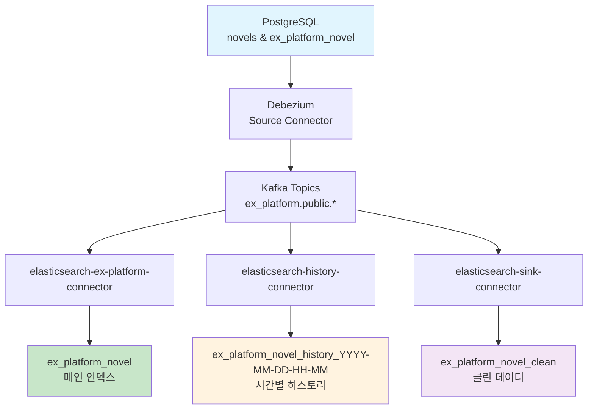

# 📚 Novel Platform CDC 파이프라인 스터디

> **다른 프로젝트에서 사용할 기술들을 미리 습득하고 테스트 학습**하기 위한 PostgreSQL → Kafka → Elasticsearch CDC(Change Data Capture) CDC 파이프라인 실습 프로젝트

## 🎯 프로젝트 개요 

이 프로젝트는 **실무 프로젝트에서 사용할 CDC 기술들을 사전 검증**하기 위한 학습 목적으로 제작되었습니다. **Kafka Connect + Debezium**을 활용한 실시간 데이터 파이프라인을 구축하여, 실제 운영 환경에서 필요한 다양한 설정들을 미리 테스트하고 기술을 습득했습니다.

### 🔍 **기술 습득 목적**
- **실무 적용 전 사전 검증**: 다른 프로젝트에서 CDC 파이프라인 구축 시 필요한 기술들을 미리 학습
- **설정 옵션 테스트**: 다양한 커넥터 설정과 Transform 체인을 실제로 구현하고 검증
- **오류 해결 경험**: 실제 운영에서 발생할 수 있는 문제들을 미리 경험하고 해결 방안 학습
- **성능 최적화 실습**: Production 레벨의 설정들을 직접 테스트하고 최적화 방법 습득

### ✨ 주요 기능
- **실시간 CDC**: PostgreSQL WAL 기반 변경사항 감지
- **동적 인덱스**: 시간별 히스토리 인덱스 자동 생성
- **다중 싱크**: 메인/히스토리/클린 데이터 분산 저장
- **메타데이터 정리**: Debezium wrapper 제거
- **중복 방지**: Primary Key 기반 Document ID

### 🧪 **스터디 하이라이트**
- **4개의 서로 다른 커넥터 설정**으로 다양한 옵션 테스트
- **Transform 체인 설계**부터 **오류 처리 전략**까지 실습
- **Production 레벨 설정**들을 직접 구현하고 검증
- **실제 발생한 오류들**과 **해결 과정**을 통한 실무 경험
- **다른 프로젝트 적용을 위한 기술 습득** 및 **설정 검증 완료**

## 🏗️ 시스템 아키텍처



### 🎨 데이터 플로우
```
PostgreSQL → Debezium → Kafka → Multiple Elasticsearch Sinks
     ↓           ↓         ↓              ↓
 소설 데이터   CDC 감지  실시간 스트림   다중 인덱스 저장
   ↓           ↓         ↓              ↓
 ID 기반      WAL 로그   토픽 분기     ┌─ 메인 데이터
 중복 방지    실시간     병렬 처리     ├─ 시간별 히스토리  
 트리거 자동   스냅샷     Transform    └─ 백업/분석용
```

## 📦 기술 스택 & 구성

| 구분 | 기술 | 버전 | 포트 | 역할 |
|------|------|------|------|------|
| **Database** | PostgreSQL | 15 | 5432 | 메인 데이터 저장소 |
| **CDC** | Debezium | 2.4 | - | PostgreSQL WAL 모니터링 |
| **Message Broker** | Apache Kafka | 7.5.0 | 6092 | 실시간 데이터 스트리밍 |
| **Connect Platform** | Kafka Connect | 7.5.0 | 8083 | Source/Sink 커넥터 관리 |
| **Search Engine** | Elasticsearch | 8.11.0 | 9200 | 검색 및 분석 엔진 |
| **Visualization** | Kibana | 8.11.0 | 5601 | 데이터 시각화 |
| **Monitoring** | Kafka UI | latest | 8080 | 토픽 & 커넥터 모니터링 |

## 🚀 빠른 시작

### 1️⃣ 프로젝트 클론 & 실행
```bash
git clone <repository-url>
cd CDC-Kafka-elasticsearch-postgresql-study

# 전체 스택 실행
docker-compose up -d

# 서비스 상태 확인 (모든 서비스가 healthy 될 때까지 대기)
docker-compose ps
```

### 2️⃣ 커넥터 자동 설정
```bash
# CDC 파이프라인 커넥터 등록
./setup-connectors.sh

# 커넥터 상태 확인
curl -s http://localhost:8083/connectors | jq .
```

### 3️⃣ 차별화된 테스트 데이터 삽입
```bash
# 한국 웹소설 + 해외 플랫폼 소설 데이터 삽입
./test-insert-novels.sh
```

## 📊 데이터 모델

### 📖 `novels` 테이블 - 한국 웹소설
```sql
CREATE TABLE novels (
    id SERIAL PRIMARY KEY,
    title VARCHAR(500) NOT NULL,           -- 나 혼자만 레벨업, 전지적 독자 시점 등
    author VARCHAR(200) NOT NULL,          -- 추공, 싱숑, 김독자 등
    platform VARCHAR(100) NOT NULL,       -- 네이버 시리즈, 카카오페이지, 리디북스
    url TEXT NOT NULL,                     -- https://series.naver.com/novel/kr_*
    description TEXT,                      -- 한국어 설명
    genre VARCHAR(100),                    -- 판타지, 무협, 회귀, 학원 등
    status VARCHAR(50),                    -- 연재중, 완결, 휴재
    total_chapters INTEGER DEFAULT 0,     -- 50-149 화
    view_count INTEGER DEFAULT 0,         -- 10K-1M 범위
    like_count INTEGER DEFAULT 0,         -- 1K-50K 범위
    rating DECIMAL(3,2),                  -- 4.0-6.9 범위
    created_at TIMESTAMP DEFAULT CURRENT_TIMESTAMP,
    updated_at TIMESTAMP DEFAULT CURRENT_TIMESTAMP
);
```

### 🌍 `ex_platform_novel` 테이블 - 해외 플랫폼 소설
```sql
CREATE TABLE ex_platform_novel (
    id SERIAL PRIMARY KEY,
    platform_id VARCHAR(100) NOT NULL,    -- EN-1000, EN-1001 등
    platform_name VARCHAR(100) NOT NULL,  -- Amazon Kindle, Webnovel, Royal Road
    title VARCHAR(500) NOT NULL,          -- Harry Potter, Lord of the Rings 등
    author VARCHAR(200) NOT NULL,         -- J.K. Rowling, J.R.R. Tolkien 등
    url TEXT NOT NULL,                    -- https://amazon.com/kindle/novel/en_*
    description TEXT,                     -- 영어 설명
    genre VARCHAR(100),                   -- Fantasy, Epic Fantasy, Cyberpunk 등
    status VARCHAR(50),                   -- 연재중, 완결, 휴재
    total_chapters INTEGER DEFAULT 0,    -- 100-399 화
    view_count BIGINT DEFAULT 0,          -- 100K-5M 범위 (더 높음)
    like_count INTEGER DEFAULT 0,        -- 5K-100K 범위 (더 높음)
    rating DECIMAL(3,2),                 -- 4.5-6.9 범위 (더 높음)
    publication_date TIMESTAMP,           -- 발행일
    last_chapter_date TIMESTAMP,          -- 마지막 업데이트
    crawled_at TIMESTAMP DEFAULT CURRENT_TIMESTAMP,
    created_at TIMESTAMP DEFAULT CURRENT_TIMESTAMP,
    updated_at TIMESTAMP DEFAULT CURRENT_TIMESTAMP,
    
    UNIQUE(platform_name, platform_id)    -- 플랫폼별 중복 방지
);
```

## 🔌 Kafka Connect 커넥터 구성

> **📚 스터디 노트**: 이 프로젝트에서는 **다른 프로젝트에서 사용할 다양한 커넥터 설정 옵션들을 테스트**하며 실습했습니다. Transform 체인, 오류 처리, 성능 최적화, 키 처리 전략 등 **실무 적용 가능한 Production 레벨의 설정들**을 직접 구현하고 검증했습니다.

### 1. **PostgreSQL Source Connector (Debezium)**
```json
{
  "name": "postgres-connector",
  "connector.class": "io.debezium.connector.postgresql.PostgresConnector",
  "database.hostname": "postgres",
  "database.dbname": "novel_platform",
  "table.include.list": "public.novels,public.ex_platform_novel",
  "topic.prefix": "ex_platform",
  "transforms": "route",
  "transforms.route.type": "org.apache.kafka.connect.transforms.RegexRouter",
  "transforms.route.regex": "ex_platform\\.public\\.(.*)",
  "transforms.route.replacement": "ex_platform.public.$1"
}
```

### 2. **Elasticsearch Sink Connectors**

#### A. 메인 데이터 커넥터
```json
{
  "name": "elasticsearch-ex-platform-connector",
  "topics": "ex_platform.public.novels",
  "index": "ex_platform_novel",
  "transforms": "unwrap,extractKeyField",
  "transforms.unwrap.type": "io.debezium.transforms.ExtractNewRecordState",
  "transforms.extractKeyField.type": "org.apache.kafka.connect.transforms.ExtractField$Key",
  "transforms.extractKeyField.field": "id"
}
```

#### B. 히스토리 커넥터 (시간별 분할)
```json
{
  "name": "elasticsearch-history-connector", 
  "topics": "ex_platform.public.ex_platform_novel",
  "transforms": "unwrap,addTS,route",
  "transforms.unwrap.type": "io.debezium.transforms.ExtractNewRecordState",
  "transforms.addTS.type": "org.apache.kafka.connect.transforms.InsertField$Value",
  "transforms.addTS.timestamp.field": "history_timestamp",
  "transforms.route.type": "org.apache.kafka.connect.transforms.TimestampRouter",
  "transforms.route.topic.format": "ex_platform_novel_history_${timestamp}",
  "transforms.route.timestamp.format": "yyyy-MM-dd-HH-mm",
  "flush.synchronously": "true"
}
```

#### C. 클린 데이터 커넥터
```json
{
  "name": "elasticsearch-sink-connector",
  "topics": "ex_platform.public.ex_platform_novel", 
  "index": "ex_platform_novel_clean",
  "transforms": "unwrap,extractKeyField",
  "transforms.unwrap.type": "io.debezium.transforms.ExtractNewRecordState",
  "transforms.extractKeyField.type": "org.apache.kafka.connect.transforms.ExtractField$Key"
}
```

## 🧪 커넥터 설정 테스트 스터디

### 📊 **테스트한 다양한 설정 옵션들**

이 프로젝트에서는 **4개의 서로 다른 커넥터**를 통해 다양한 설정 옵션들을 실습했습니다:

| 커넥터 | 테스트 목적 | 주요 설정 | 학습 포인트 |
|--------|-------------|----------|-------------|
| **postgres-connector** | WAL 기반 CDC | `pgoutput`, `RegexRouter` | 토픽 이름 변환, 스냅샷 모드 |
| **elasticsearch-sink-connector** | 기본 동기화 | `ExtractField$Value` | 단순 after 필드 추출 |
| **elasticsearch-ex-platform-connector** | 고급 동기화 | `ExtractNewRecordState` + `ExtractField$Key` | Document ID 커스터마이징 |
| **elasticsearch-history-connector** | 동적 인덱스 | `TimestampRouter` + `InsertField$Value` | 시간별 인덱스 분할 |

### 🔧 **Transform 체인 실습**

#### A. 단순 Transform (novels 인덱스)
```json
"transforms": "extractValue,route"
// 목적: Debezium after 필드만 추출
```

#### B. 복합 Transform (ex_platform_novel 인덱스)
```json
"transforms": "unwrap,extractValue,extractKeyField,route"
// 목적: wrapper 제거 + Document ID 커스터마이징
```

#### C. 고급 Transform (history 인덱스)
```json
"transforms": "unwrap,extractAfter,addTS,route"
// 목적: 타임스탬프 추가 + 동적 인덱스 생성
```

### 🎯 **오류 처리 전략 테스트**

```json
{
  "errors.tolerance": "all",              // 모든 오류 허용
  "errors.log.enable": "true",            // 오류 로깅 활성화
  "errors.log.include.messages": "true",  // 상세 오류 메시지
  "behavior.on.malformed.documents": "warn",  // 잘못된 문서 처리
  "behavior.on.null.values": "ignore"     // NULL 값 처리
}
```

### ⚡ **성능 최적화 실습**

```json
{
  "batch.size": 100,                      // 배치 크기 조정
  "max.in.flight.requests": 1,            // 순서 보장
  "flush.timeout.ms": 10000,              // 응답성 향상
  "flush.synchronously": "true"           // SMT 활성화 (중요!)
}
```

## 🎯 핵심 기능 구현

### 1. **동적 인덱스 생성 (시간별)**
```bash
# TimestampRouter SMT 설정
"transforms.route.topic.format": "ex_platform_novel_history_${timestamp}"
"transforms.route.timestamp.format": "yyyy-MM-dd-HH-mm"

# 결과: ex_platform_novel_history_2025-01-15-14-30
```

### 2. **Debezium Wrapper 제거**
```json
// 변경 전: Debezium 원본 구조
{
  "op": "c",
  "before": null,
  "after": {
    "id": 1,
    "title": "Lord of the Rings",
    "author": "J.R.R. Tolkien"
  },
  "source": {...}
}

// 변경 후: ExtractNewRecordState 적용
{
  "id": 1,
  "title": "Lord of the Rings", 
  "author": "J.R.R. Tolkien",
  "history_timestamp": 1751717783199
}
```

### 3. **중복 방지 Document ID 전략**
```json
// Primary Key 기반 Document ID
"key.ignore": false,
"transforms.extractKeyField.type": "org.apache.kafka.connect.transforms.ExtractField$Key",
"transforms.extractKeyField.field": "id"

// 결과: PostgreSQL의 PK가 Elasticsearch Document ID로 사용
```

## 🧪 실습 가이드

### Step 1: 기본 CDC 테스트
```bash
# 1. 한국 웹소설 추가
docker exec postgres-db psql -U postgres -d novel_platform -c "
INSERT INTO novels (title, author, platform, genre, status) 
VALUES ('새로운 회귀물', '김회귀', '네이버 시리즈', '회귀', '연재중');
"

# 2. 해외 플랫폼 소설 추가  
docker exec postgres-db psql -U postgres -d novel_platform -c "
INSERT INTO ex_platform_novel (platform_id, platform_name, title, author, genre, status) 
VALUES ('AMZ-12345', 'Amazon Kindle', 'New Fantasy Epic', 'Fantasy Author', 'Epic Fantasy', '연재중');
"
```

### Step 2: 실시간 CDC 모니터링
```bash
# Kafka 토픽 메시지 확인
docker exec kafka bash -c "
kafka-console-consumer --bootstrap-server localhost:29092 \
  --topic ex_platform.public.novels --from-beginning
"

# Kafka UI에서 토픽 확인
# http://localhost:8080
```

### Step 3: Elasticsearch 인덱스 확인
```bash
# 메인 인덱스 (실시간 업데이트)
curl -s "http://localhost:9200/ex_platform_novel/_search?pretty"

# 히스토리 인덱스 (시간별 분할)
curl -s "http://localhost:9200/ex_platform_novel_history_*/_search?pretty"

# 클린 데이터 인덱스 (wrapper 제거됨)
curl -s "http://localhost:9200/ex_platform_novel_clean/_search?pretty"
```

### Step 4: 변경 이력 추적 테스트
```bash
# 1. 조회수 업데이트
docker exec postgres-db psql -U postgres -d novel_platform -c "
UPDATE ex_platform_novel 
SET view_count = view_count + 1000, rating = 4.9
WHERE platform_id = 'AMZ-12345';
"

# 2. 메인 인덱스 확인 (최신 상태)
curl -s "http://localhost:9200/ex_platform_novel/_doc/1" | jq .

# 3. 히스토리 인덱스 확인 (변경 이력)
curl -s "http://localhost:9200/ex_platform_novel_history_*/_search" | jq .
```

## 🌐 접속 정보

| 서비스 | URL | 용도 |
|--------|-----|------|
| **Kafka UI** | http://localhost:8080 | 토픽, 커넥터, 메시지 모니터링 |
| **Kibana** | http://localhost:5601 | 데이터 시각화 & 검색 |
| **Elasticsearch** | http://localhost:9200 | REST API |
| **Kafka Connect REST** | http://localhost:8083 | 커넥터 관리 API |

## 📈 성능 최적화 설정

### Kafka Connect 설정
```properties
# 처리량 최적화
batch.size=100
max.in.flight.requests=1
flush.timeout.ms=10000

# 오류 허용
errors.tolerance=all
errors.log.enable=true
errors.log.include.messages=true

# 히스토리 커넥터 전용
flush.synchronously=true  # SMT 활성화 필수
```

### Elasticsearch 매핑
```json
{
  "settings": {
    "number_of_shards": 1,
    "number_of_replicas": 0,
    "refresh_interval": "1s"
  },
  "mappings": {
    "properties": {
      "title": {"type": "text", "analyzer": "standard"},
      "author": {"type": "keyword"},
      "genre": {"type": "keyword"},
      "view_count": {"type": "long"},
      "rating": {"type": "float"},
      "created_at": {"type": "date"},
      "history_timestamp": {"type": "date"}
    }
  }
}
```

## 🔧 트러블슈팅

### 1. **커넥터 상태 확인**
```bash
# 모든 커넥터 상태
curl -s http://localhost:8083/connectors | jq .

# 특정 커넥터 상세 상태
curl -s http://localhost:8083/connectors/postgres-connector/status | jq .

# 커넥터 재시작
curl -X POST http://localhost:8083/connectors/postgres-connector/restart
```

### 2. **MAP is not supported as document id 오류**
```json
// 문제: ValueToKey transform에서 복수 필드 사용
"transforms.setKey.fields": "id,timestamp"  // ❌

// 해결: ExtractField$Key 사용
"transforms.extractKeyField.type": "org.apache.kafka.connect.transforms.ExtractField$Key",
"transforms.extractKeyField.field": "id"    // ✅
```

### 3. **TimestampRouter 미작동**
```json
// 필수 설정 누락
"flush.synchronously": "true"  // ✅ 반드시 필요
```

### 4. **PostgreSQL WAL 설정**
```sql
-- postgresql.conf
wal_level = logical
max_wal_senders = 4
max_replication_slots = 4

-- 확인
SELECT * FROM pg_replication_slots;
```

## 📚 기술 습득 결과 & 학습 자료

### 🎯 **다른 프로젝트 적용을 위해 습득한 기술들**
- **Transform 체인 설계**: 4가지 서로 다른 Transform 전략으로 동일한 데이터를 다양하게 처리
- **오류 처리 전략**: Production 환경에서 중요한 `errors.tolerance=all` 등 안정성 설정
- **성능 최적화**: `batch.size`, `flush.timeout.ms` 등으로 처리량 향상
- **키 처리 전략**: Document ID 커스터마이징으로 중복 방지 및 업데이트 처리
- **동적 인덱스**: `TimestampRouter`로 시간별 인덱스 자동 생성
- **실무 적용 가능한 설정들**: 실제 운영 환경에서 바로 사용할 수 있는 검증된 설정 확보

### 📖 **참고 문서**
- [Debezium PostgreSQL Connector](https://debezium.io/documentation/reference/connectors/postgresql.html)
- [Kafka Connect Elasticsearch](https://docs.confluent.io/kafka-connectors/elasticsearch/current/overview.html)
- [Single Message Transforms](https://kafka.apache.org/documentation/#connect_transforms)
- [PostgreSQL Change Data Capture](https://www.postgresql.org/docs/current/logical-replication.html)

### 🧪 **실습으로 검증한 설정들**
- ✅ **MAP 오류 해결**: `ExtractField$Key` 사용으로 Document ID 문제 해결
- ✅ **TimestampRouter 활성화**: `flush.synchronously=true` 필수 설정 발견
- ✅ **다중 Sink 전략**: 하나의 소스에서 3개의 서로 다른 인덱스 생성
- ✅ **Debezium Wrapper 제거**: `ExtractNewRecordState`로 깔끔한 데이터 구조
- ✅ **오류 허용 모드**: 안정적인 파이프라인 운영을 위한 필수 설정

## 🎯 다음 단계 (다른 프로젝트 적용 계획)

1. **실시간 알림 시스템** 구축 (Kafka Streams + WebSocket)
2. **데이터 품질 모니터링** (Schema Registry + Avro)
3. **멀티 클러스터 복제** (MirrorMaker 2.0)
4. **스트림 처리** (KSQL/Kafka Streams)

### 🚀 **실무 적용 준비 완료**
- ✅ **CDC 파이프라인 설정 검증** 완료
- ✅ **다양한 커넥터 옵션 테스트** 완료
- ✅ **오류 해결 경험** 축적
- ✅ **성능 최적화 방법** 습득
- ✅ **Production 레벨 설정** 확보

---

**📌 기술 습득 스터디 프로젝트**: 이 프로젝트는 **다른 프로젝트에서 사용할 CDC 기술들을 미리 습득하고 검증**하기 위한 학습 목적으로 제작되었습니다. 실제 운영 환경에서는 보안, 모니터링, 백업 등 추가 고려사항이 필요합니다.